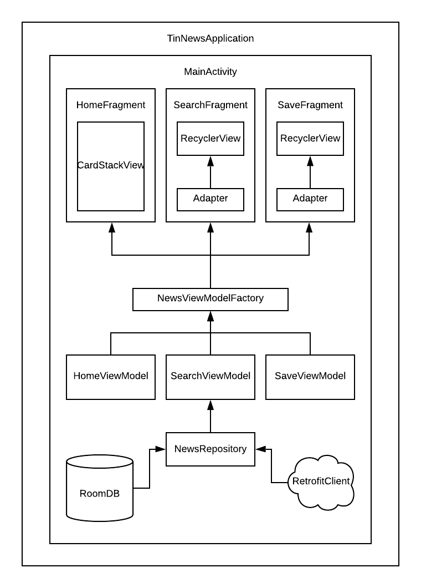

# TinNewsKotlin

## Overview
This is Kotlin version of the TinNews

## What you learn here

* Jetpat Navigation Component
* Simple MVVM Architecture(LiveData/ViewModel)
* Room 
* Retrofit/Coroutines
* Kotlin

## Preview

### Home Page

### Search Page

### Save Page

### Save Detail Page
